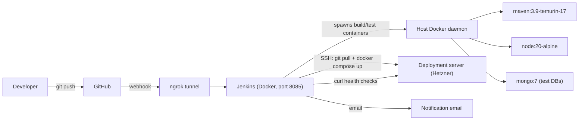
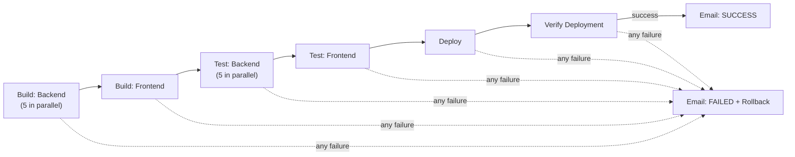
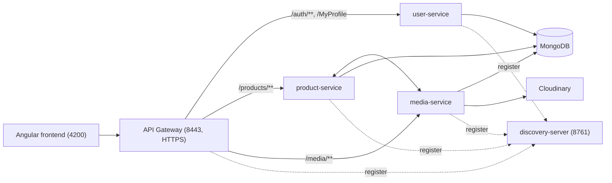

# mr-jenk

A **Jenkins CI/CD pipeline** for the [buy-01](#the-application-buy-01) e-commerce platform (Spring Boot microservices + Angular).

Every push to the repository triggers a Jenkins pipeline that **builds** every service, **runs the automated tests**, **deploys** the new version to a remote server, **verifies** that the deployment is healthy, **rolls back** automatically if anything fails, and **emails** the result.

## Table of contents

- [Project goals](#project-goals)
- [Architecture of the CI/CD setup](#architecture-of-the-cicd-setup)
- [Pipeline stages](#pipeline-stages)
- [Rollback strategy](#rollback-strategy)
- [Notifications](#notifications)
- [Security](#security)
- [Setting up Jenkins](#setting-up-jenkins)
- [Triggering builds automatically (GitHub webhook + ngrok)](#triggering-builds-automatically-github-webhook--ngrok)
- [Setting up the deployment server](#setting-up-the-deployment-server)
- [Repository structure](#repository-structure)
- [The application: buy-01](#the-application-buy-01)
- [Running the application locally](#running-the-application-locally)
- [Environment variables](#environment-variables)

## Project goals

What the subject asks for, and how this project does it:

| Requirement | How it is done |
|---|---|
| Set up a Jenkins instance | Custom Jenkins Docker image ([jenkins/Dockerfile](jenkins/Dockerfile)), with Docker, `sshpass` and the required plugins already installed |
| Build automatically | A declarative [Jenkinsfile](Jenkinsfile) builds the 5 backend services (Maven) in parallel, then builds the Angular frontend (npm) |
| Run automated tests | JUnit tests for each backend service (with a temporary MongoDB container where needed) and Vitest tests for the frontend. If a test fails, the pipeline stops |
| Trigger on every commit | A GitHub webhook calls Jenkins on every push. Jenkins runs locally, so it is exposed with ngrok |
| Automated deployment | Jenkins connects to a remote server (Hetzner) over SSH, pulls the new code and runs `docker compose up --build -d` |
| Rollback strategy | The commit that was running before the deploy is saved. If the pipeline fails, the server is reset to that commit and redeployed |
| Notifications | An email is sent on every success or failure |
| Security | Secrets live in the Jenkins credentials store and never in the repository. Builds run inside throwaway Docker containers |

## Architecture of the CI/CD setup



- Jenkins runs in a container, but it mounts the host's Docker socket (`/var/run/docker.sock`). This lets it start other containers on the host for each stage, so no JDK, Maven or Node has to be installed in the Jenkins image.
- A named Docker volume (`maven-repo`) caches Maven dependencies between builds, which makes builds much faster.

## Pipeline stages

The pipeline is declared in [Jenkinsfile](Jenkinsfile) with `agent none`, so each stage chooses its own container.



### 1. Build: Backend Services (parallel)
`discovery-server`, `user-service`, `product-service`, `media-service` and `api-gateway` are built at the same time, each in a `maven:3.9-eclipse-temurin-17` container:
```bash
mvn -B -DskipTests clean package
```

### 2. Build: Frontend
In a `node:20-alpine` container:
```bash
npm ci
npm run build
```

### 3. Test: Backend Services (parallel)
- **discovery-server**: `mvn -B verify` directly. It does not use a database.
- **user / product / media services**: these need MongoDB. For each one the pipeline:
  1. creates a Docker network just for this build (`backend-ci-<BUILD_NUMBER>-<service>`),
  2. starts a temporary `mongo:7` container on that network,
  3. runs `mvn -B clean verify` in a Maven container on the same network, with `MONGODB_URI` pointing to that Mongo container,
  4. removes the container and the network, even if the tests fail (`try/finally`).

  The names include the build number, so two builds running at the same time do not clash.
- **api-gateway**: it serves HTTPS, so it needs a keystore to start. The pipeline creates a temporary self-signed `keystore.p12` with `keytool`, using a password from Jenkins credentials (`ci-keystore-password`), and then runs `mvn -B verify`.

JUnit reports (`target/surefire-reports/*.xml`) are published for every service, so test results show up in the Jenkins UI (and Blue Ocean).

### 4. Test: Frontend
In a `node:20-alpine` container:
```bash
npm ci
npm test        # Vitest
```

### 5. Deploy
Jenkins connects to the deployment server over SSH (`sshpass` + credentials) and:
1. saves the commit currently deployed (`git rev-parse HEAD`) as `PREVIOUS_SHA`,
2. runs `cd /root/mr-jenk && git pull && docker compose up --build -d`.

### 6. Verify Deployment
A container that is running is not always a working app, so the pipeline checks the live endpoints:
```bash
curl -f -k https://$DEPLOY_HOST:8443/actuator/health   # API gateway (self-signed TLS)
curl -f    http://$DEPLOY_HOST:4200                    # Angular frontend
```
If either check fails, the stage fails. This triggers the rollback.

## Rollback strategy

Rollback is in the pipeline's `post { failure { ... } }` block:

1. Before deploying, the **Deploy** stage saves the commit SHA that the server is running (`PREVIOUS_SHA`).
2. If any later step fails (for example the deploy itself or the health check), Jenkins connects to the server again and runs:
   ```bash
   git reset --hard $PREVIOUS_SHA && docker compose up --build -d
   ```
3. The server goes back to the last known-good version.

If the failure happens **before** the Deploy stage (a build or test failure), `PREVIOUS_SHA` is not set. In that case nothing is rolled back, because nothing on the server was changed: broken code never reaches production.

## Notifications

The pipeline uses the Jenkins **Mailer** plugin to send an email after every run:

- **SUCCESS**: `SUCCESS: <job> #<build>` with a link to the build.
- **FAILED**: `FAILED: <job> #<build>` with a link to the build logs. This email is sent before the rollback runs.

SMTP is configured in *Manage Jenkins → System → E-mail Notification* (for example Gmail SMTP with an app password).

## Security

- **No secrets in Git.** Everything sensitive is stored in the Jenkins credentials store and injected with `withCredentials`, so Jenkins hides the values in the console output:

  | Credential ID | Type | Used for |
  |---|---|---|
  | `deploy-server-ssh` | Username + password | SSH login to the deployment server |
  | `deploy-server-host` | Secret text | IP or hostname of the deployment server |
  | `ci-keystore-password` | Secret text | Password for the temporary CI keystore of the api-gateway |

- The application's own secrets (`JWT_SECRET`, `CLOUDINARY_URL`, keystore password…) are kept in a `.env` file on the server. It is ignored by Git (see [.gitignore](.gitignore)), and [.env.example](.env.example) shows the variables it needs.
- **Isolated builds.** Each build and test runs in a fresh container on its own Docker network, which is removed afterwards.
- **Jenkins access.** Jenkins is protected by its own admin login. Use *Manage Jenkins → Security* to restrict permissions per user, for example with matrix-based security.

## Setting up Jenkins

The Jenkins image is defined in [jenkins/Dockerfile](jenkins/Dockerfile):

- base image: `jenkins/jenkins:lts-jdk21`
- extra packages: `docker.io` (to run the build containers) and `sshpass` (for the deploy over SSH)
- plugins ([jenkins/plugins.txt](jenkins/plugins.txt)): `blueocean`, `docker-workflow`, `junit`, `mailer`

Build and start it with [jenkins/run_jenkins.sh](jenkins/run_jenkins.sh):

```bash
cd jenkins
./run_jenkins.sh
```

which runs:

```bash
docker build -t my-jenkins .
docker run -d --name jenkins \
  -p 8085:8080 -p 50000:50000 \
  -v jenkins_home:/var/jenkins_home \
  -v $DOCKER_SOCK:/var/run/docker.sock \
  -u root my-jenkins
```

On this machine `docker` is actually **Podman**, so the Docker socket is `/run/user/<uid>/podman/podman.sock` (not `/var/run/docker.sock`). The script starts it with `systemctl --user start podman.socket` and mounts it into Jenkins as `/var/run/docker.sock`, so the pipeline can run `docker` commands.

Then:

1. Open http://localhost:8085 and unlock Jenkins with the password from
   `docker exec jenkins cat /var/jenkins_home/secrets/initialAdminPassword`.
2. Create an admin user.
3. Add the three credentials from the [Security](#security) table.
4. Configure SMTP for email notifications.
5. Create a **Pipeline** job (or Multibranch Pipeline) with **Pipeline script from SCM** that points to this repository and uses `Jenkinsfile`.
6. Enable **GitHub hook trigger for GITScm polling** in the job's build triggers.

## Triggering builds automatically (GitHub webhook + ngrok)

Jenkins runs on a local machine, so GitHub cannot reach it directly. [jenkins/run_ngrok.sh](jenkins/run_ngrok.sh) opens a public tunnel to it:

```bash
./jenkins/run_ngrok.sh <NGROK_AUTHTOKEN>
```

In the GitHub repository, go to *Settings → Webhooks → Add webhook* and set:

- **Payload URL**: `https://<your-ngrok-subdomain>.ngrok-free.app/github-webhook/`
- **Content type**: `application/json`
- **Events**: *Just the push event*

After that, every `git push` starts a new pipeline run.

## Setting up the deployment server

On the target server (a Hetzner VPS in our case):

1. Install Docker, Docker Compose and Git.
2. Clone the repository to `/root/mr-jenk` (the `DEPLOY_PATH` in the Jenkinsfile).
3. Create `/root/mr-jenk/.env` from [.env.example](.env.example) and fill in the real secrets.
4. Put `keystore.p12` in `api-gateway/src/main/resources/` (see [HTTPS](#https-api-gateway)).
5. Allow SSH login for the user stored in `deploy-server-ssh`, and open ports `8443` (gateway) and `4200` (frontend).

## Repository structure

```
mr-jenk/
├── Jenkinsfile              # the CI/CD pipeline
├── jenkins/
│   ├── Dockerfile           # Jenkins image with Docker CLI + sshpass + plugins
│   ├── plugins.txt          # blueocean, docker-workflow, junit, mailer
│   ├── run_jenkins.sh       # build + run the Jenkins container
│   └── run_ngrok.sh         # expose Jenkins to GitHub webhooks
├── compose.yml              # runs the full buy-01 stack (used for deployment)
├── .env.example             # template for the app's secrets
├── discovery-server/        # Eureka registry
├── api-gateway/             # entry point, JWT validation, HTTPS
├── user-service/            # accounts, auth, profile
├── product-service/         # product catalog
├── media-service/           # images (Cloudinary)
└── frontend/                # Angular app
```

---

## The application: buy-01

The pipeline builds, tests and deploys **buy-01**, an e-commerce platform. Users sign up as **clients** or **sellers**. Sellers manage their products and product images, and clients browse them.



| Service | Port | Responsibility |
|---|---|---|
| `discovery-server` | 8761 | Eureka registry |
| `api-gateway` | 8443 | Single public entry point over HTTPS; checks JWTs and forwards `X-User-Id` / `X-User-Role` to the services |
| `user-service` | 8081 (internal) | Registration, login (issues the JWT), profile |
| `product-service` | 8082 (internal) | Product CRUD and ownership checks |
| `media-service` | 8083 (internal) | Image upload and validation, stored on Cloudinary |
| `frontend` | 4200 | Angular 21 SPA |
| `mongodb` | 27017 (internal) | One database per service: `users_db`, `products_db`, `media_db` |

**Tech stack:** Java 17, Spring Boot, Spring Cloud Gateway, Eureka, Spring Security, MongoDB 7, Resilience4j, Cloudinary · Angular 21, Bootstrap 5, Vitest · Docker Compose · Jenkins.

## Running the application locally

```bash
cp .env.example .env      # then fill in JWT_SECRET, CLOUDINARY_URL, ...
docker compose up --build
```

- Frontend: http://localhost:4200
- API gateway: https://localhost:8443 (self-signed certificate)
- Eureka dashboard: http://localhost:8761

Tests, without Jenkins:

```bash
cd <service> && ./mvnw test     # backend (user/product/media services need MongoDB)
cd frontend && npm test         # frontend
```

### HTTPS (api-gateway)

The gateway serves HTTPS with a self-signed PKCS12 keystore. Generate it with:

```bash
keytool -genkeypair -alias gateway -keyalg RSA -keysize 2048 \
  -storetype PKCS12 -keystore api-gateway/src/main/resources/keystore.p12 \
  -validity 3650 -dname "CN=localhost, OU=Dev, O=Vendify" \
  -storepass changeit -keypass changeit
```

`-storepass` and `-keypass` must be the same value, and it must match `SSL_KEYSTORE_PASSWORD` in `.env`.

## Environment variables

| Variable | Used by | Notes |
|---|---|---|
| `EUREKA_CLIENT_SERVICEURL_DEFAULTZONE` | all services | `http://discovery-server:8761/eureka` |
| `JWT_SECRET` | user-service, api-gateway | Must be the same in both. Generate with `openssl rand -base64 32` |
| `SSL_KEYSTORE_PATH` | api-gateway | Default `classpath:keystore.p12` |
| `SSL_KEYSTORE_PASSWORD` | api-gateway | Must match the keystore's password |
| `CORS_ALLOWED_ORIGIN` | api-gateway | Frontend origin, e.g. `http://localhost:4200` |
| `USER_MONGODB_URI` / `PRODUCT_MONGODB_URI` / `MEDIA_MONGODB_URI` | each service | One database per service |
| `CLOUDINARY_URL` | media-service | Required. Get it from the Cloudinary dashboard |
